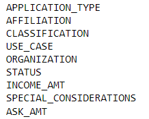
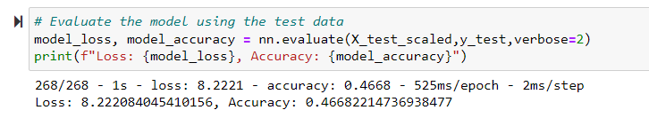
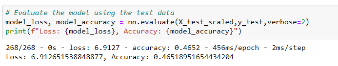

# Neural_Network_Charity_Analysis

## Project Overview - Neural Network Charity Analysis
The purpose of this analysis is to use deep-learning neural networks to analyze and classify the success of a charity.

## Results

### Data Preprocessing

What variable(s) are considered the target(s) for your model?
- the IS_SUCCESSFUL variable was considered the target of the model

What variable(s) are considered to be the features for your model?

### Compiling, Training, and Evaluating the Model

How many neurons, layers, and activation functions did you select for your neural network model, and why?
2 layers were used, with 80 and 40 neurons each.

Were you able to achieve the target model performance?
The target performance of 75% was not achieved.

What steps did you take to try and increase model performance?
- the SPECIAL_CONSIDERATIONS variable was dropped
- added a third hidden layer
- decreased the number of neurons 

        

## Summary

Overall, the results of the model did not achieve the target goal of 75%.